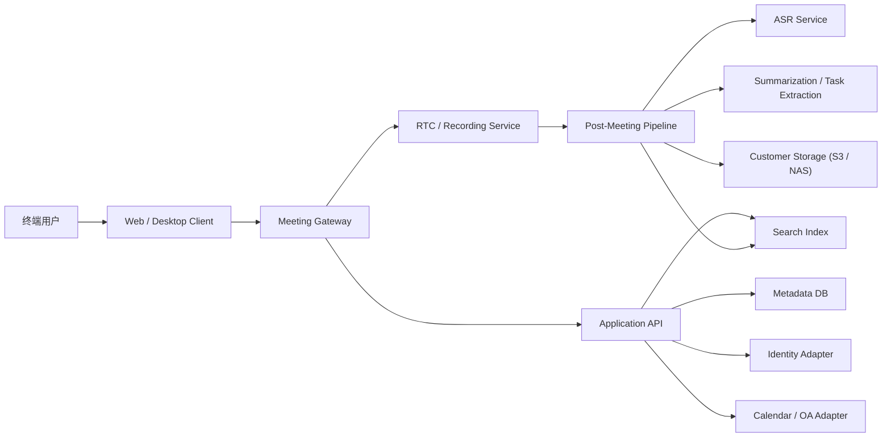

# 系统架构

## 架构原则

- 不自研底层 RTC 全栈，优先复用成熟实时音视频基础设施
- AI 能力建立在会议资产采集与归档之后，而不是反向绑架基础会议体验
- 内容数据默认留在客户域内，任何外部依赖都必须有清晰边界
- 集成与部署标准化，避免每个客户都变成定制项目

## 高层架构

## 子系统划分

### Client

- Web 端为默认首发
- 提供会议加入、屏幕共享、回放访问、纪要浏览、检索入口
- 所有与资产下载、预览、访问控制有关的动作都走服务端鉴权

### Meeting Gateway

- 管理会议会话、参会者状态、鉴权与路由
- 与 RTC 服务协调创建房间、加入会议、录制开关
- 不承担转写和纪要生成

### RTC / Recording

- 复用成熟 RTC 供应商或开源方案
- 必须支持多人会议、屏幕共享、录制
- 必须可部署在客户环境或受控网络边界内

### Application API

- 管理组织、成员、会议元数据、权限策略
- 提供会议列表、回放访问、纪要查询、搜索入口
- 维护与外部系统的接口适配

### Post-Meeting Pipeline

- 接收录制完成事件
- 触发转写、摘要、待办提取、索引构建
- 将视频、音频、转写、纪要写入客户存储
- 失败可重试，任务状态可追踪

### Search Index

- 存储转写分段、发言人标记、主题标签、纪要摘要
- 支持按会议、时间、发言人、关键词检索

### Adapters

- Identity Adapter：对接企业 SSO、目录或组织体系
- Calendar / OA Adapter：对接会邀、审批或日程系统
- Storage Adapter：对接 S3 兼容存储与 NAS

## 数据边界

控制面数据：

- 组织
- 成员
- 角色
- 会议元数据
- 任务状态

内容数据：

- 录音
- 录像
- 转写
- 纪要
- 待办提取结果

默认要求：

- 内容数据写入客户指定存储
- 控制面数据可部署在同域数据库
- 若使用外部 AI 模型，必须明确开关与数据流向

## 建议选型原则

RTC 层：

- 优先看可私有化部署能力
- 录制和屏幕共享是必须项
- 要求稳定支持 20 到 50 人会议

AI 层：

- ASR 与纪要模型解耦
- ASR 先保证可用性和说话人区分
- 摘要与待办提取允许后续替换不同 LLM

检索层：

- 优先支持结构化过滤和全文检索
- 向量检索不是 v1 必需项

## 运维与交付要求

- 提供单机试点部署方案
- 提供标准化的对象存储接入配置
- 提供最小监控项：会议状态、录制状态、转写任务状态、存储写入状态
- 提供审计日志：会议访问、回放访问、导出访问、权限变更
